TUGAS PERTEMUAN 1 MACHINE LEARNING 

Nama : Daffa Fauzan Dzaki 

Kelas : A1 

Npm  : 41155050210014 

0. Instalasi Jupyter Noterbook 

   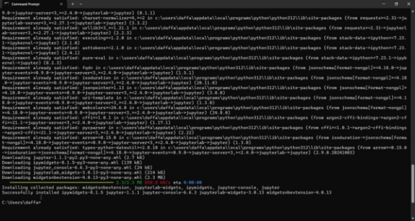

1. Instalasi library python 

   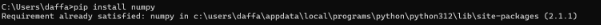

   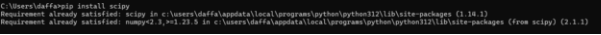

   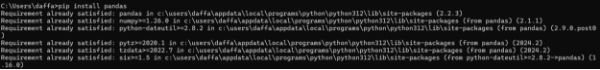

   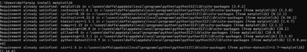

   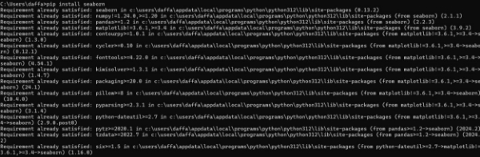

   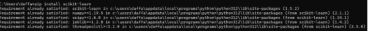

2. Jupiter notebook 

   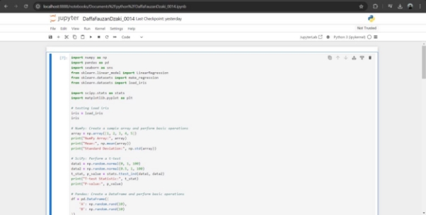

2\.0 Menggunakan google colab 

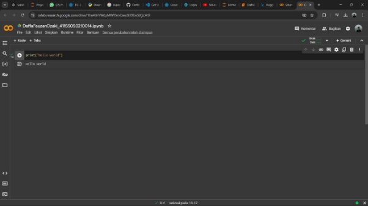

3\.0 Akun Kaggle 

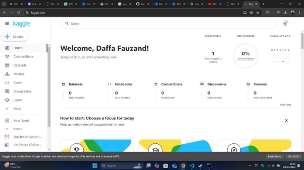

4\.0 Akun github 

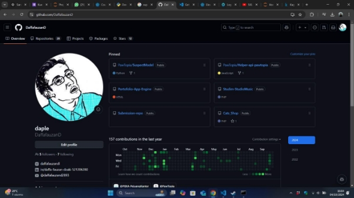

0. Load Data Sample 

   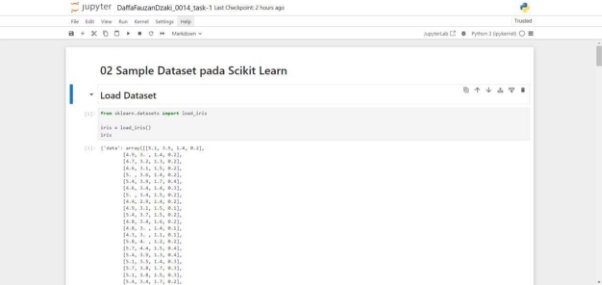

1. Metadata | Deskripsi dari sample dataset 

   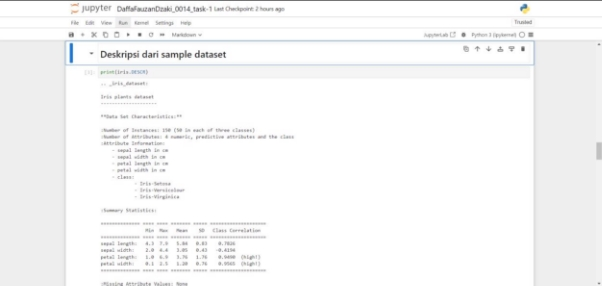

2. Explanatory & Response Variables | Features & Target 

   

   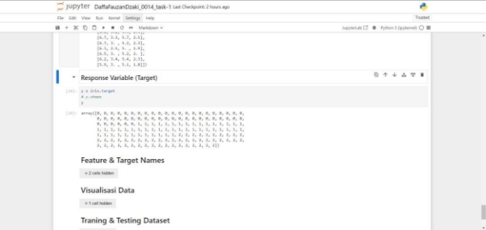

3. Visualisasi Data 

   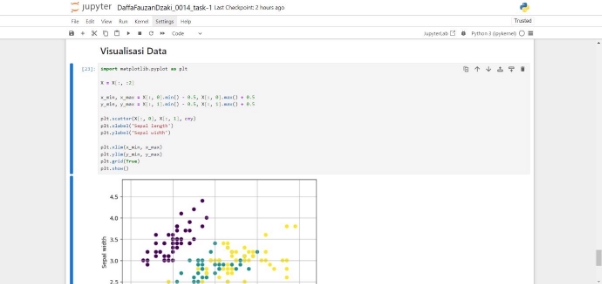

4. Training Set & Testing Set 

   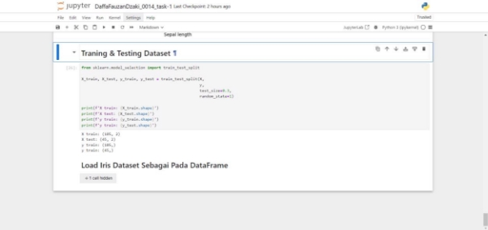

5. Load sample dataset sebagai Pandas Data Frame 

   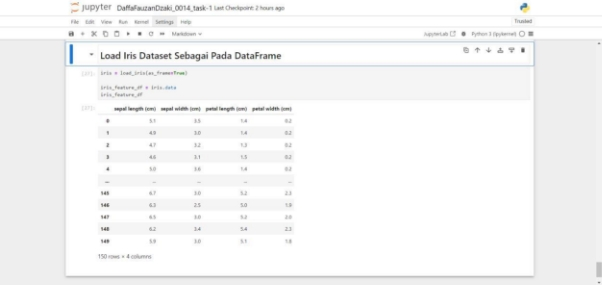

0. Persiapan dataset | Loading & splitting dataset 

   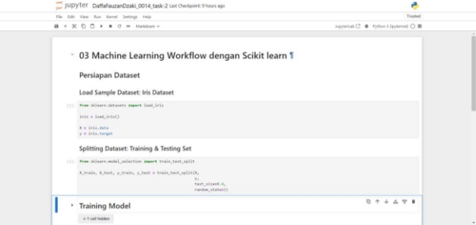

1. Training model Machine Learning 

   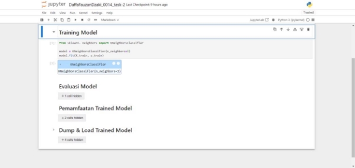

2. Evaluasi model Machine Learning 

   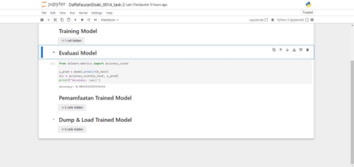

3. Pemanfaatan trained model machine learning 

   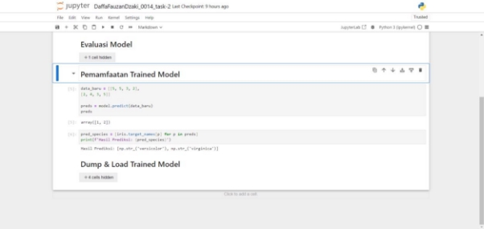

4. Deploy model Machine Learning | Dumping dan Loading model Machine Learning 

   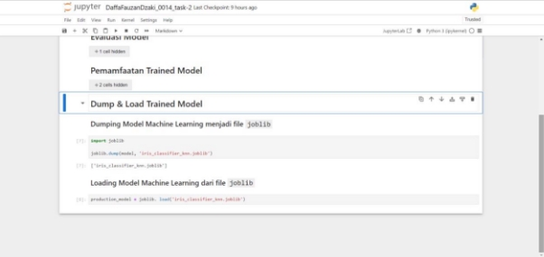

0. Persiapan sample dataset 

   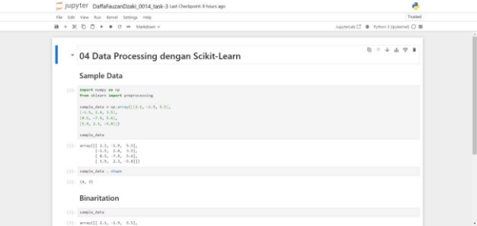

1. Teknik data preprocessing 1: binarization 

   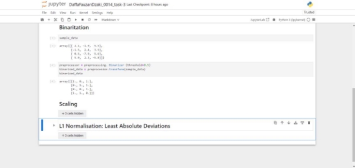

2. Teknik data preprocessing 2: scaling 

   ![ref1]

3. Teknik data preprocessing 3: normalisation 

   ![ref1]

[ref1]: Image/tg1/Aspose.Words.83006cbc-695b-4ab0-bd44-8aee8b8de3e2.026.jpeg
