TUGAS PERTEMUAN 2 MACHINE LEARNING 

Nama : Daffa Fauzan Dzaki 

Kelas : A1 

Npm  : 41155050210014 

0. Lakukan praktek dari https://youtu.be/lcjq7-2zMSA?si=f4jWJR6lY8y0BZKl  dan buat screen shot hasil run dengan nama anda pada hasil run tersebut. Praktek tersebut yaitu: 
0. Sample dataset 

   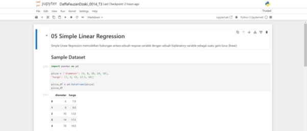

2. Visualisasi dataset 

   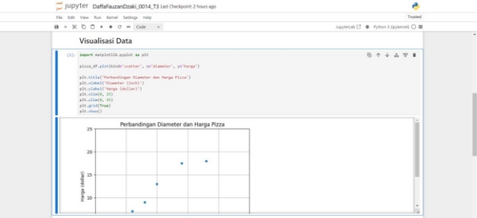

3. Transformasi dataset 

   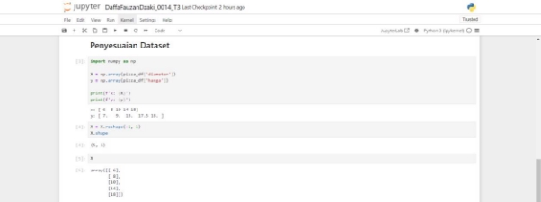

4. Training Simple Linear Regression Model 

   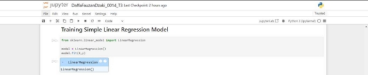

5. Visualisasi Simple Linear Regression Model | Penjelasan persamaan garis linear 

   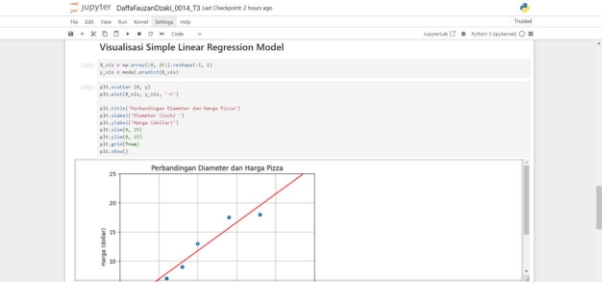

6. Kalkulasi nilai slope 

   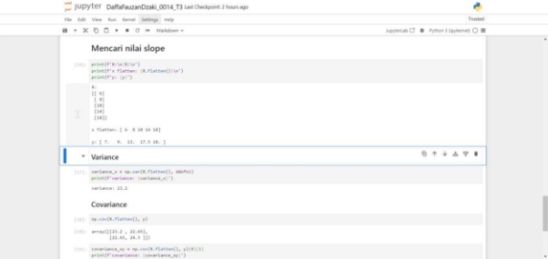

   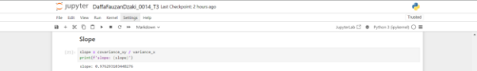

7. Kalkukasi nilai intercept 

   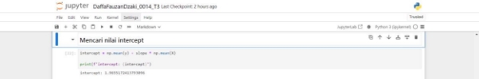

8. Prediksi harga pizza dengan Simple Linear Regression Model 

   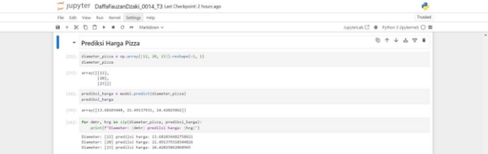

9. Evaluasi model dengan Coefficient of Determination | R Squared 

   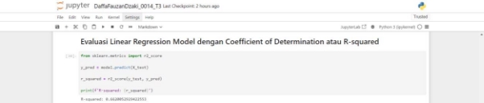

10. Kalkulasi nilai R Squared | Coefficient of Determination 

    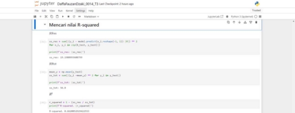

0. Lakukan praktek dari https://youtu.be/nWJUJenAyB8?si=BQDzWwrMnr8jtzpV  dan buat screen shot hasil run dengan nama anda pada hasil run tersebut. Praktek tersebut yaitu: 
0. Persiapan sample dataset 

   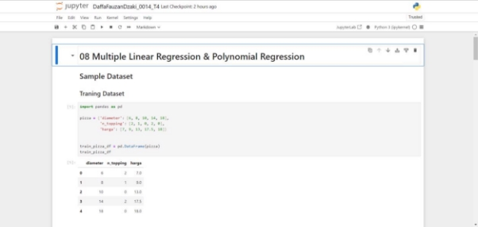

   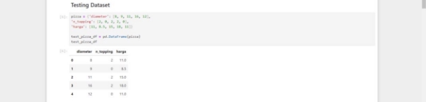

2. Preprocessing dataset 

   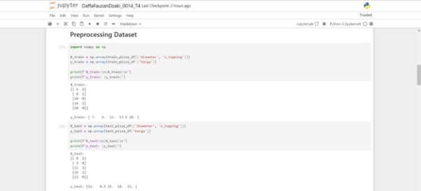

3. Pengenalan Multiple Linear Regression | Apa itu Multiple Linear Regression? 

   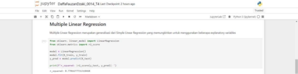

4. Pengenalan Polynomial Regression | Apa itu Polynomial Regression? 

   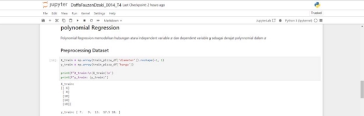

5. Quadratic Polynomial Regression 

   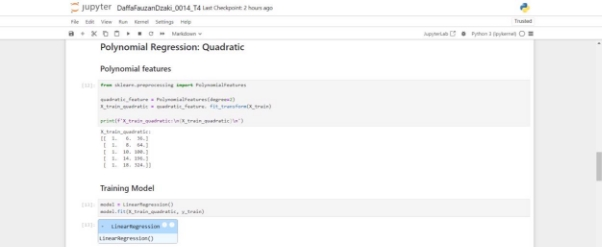

   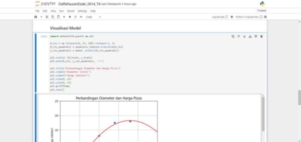

6. Linear Regression vs Quadratic Polynomial Regression vs Cubic Polynomial Regression 

   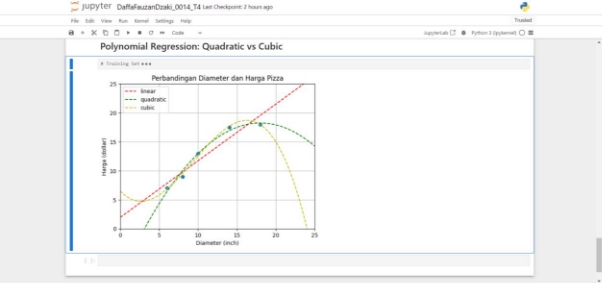

0. Lakukan praktek dari https://youtu.be/oe7DW4rSH1o?si=H-PZJ9rs9-Kab-Ln  dan buat screen shot hasil run dengan nama anda pada hasil run tersebut. Praktek tersebut yaitu: 
0. Formula dasar pembentuk Logistic Regression | Fungsi Sigmoid 

   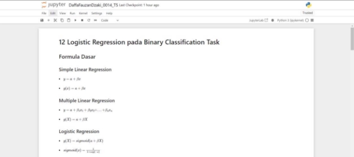

2. Persiapan dataset | SMS Spam Collection Dataset 

   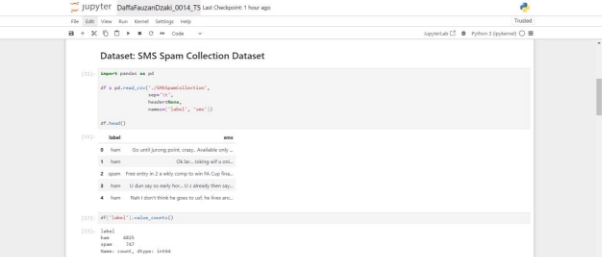

3. Pembagian training dan testing set 

   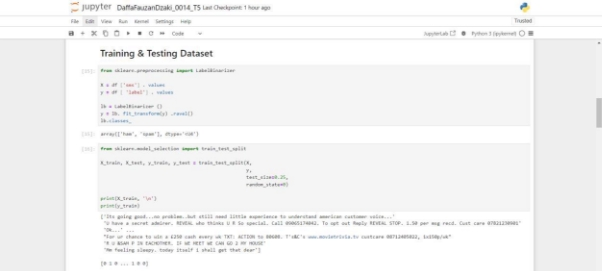

4. Feature extraction dengan TF-IDF 

   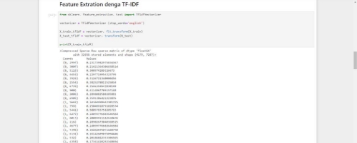

5. Binary Classification dengan Logistic Regression 

   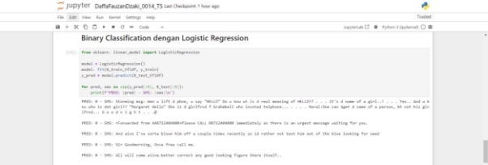

6. Evaluation Metrics pada Binary Classification Task 

   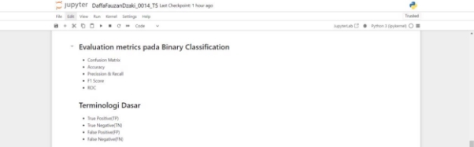

7. Pengenalan Confusion Matrix 

   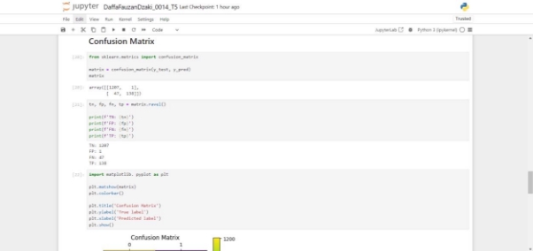

8. Pengenalan Accuracy Score 

   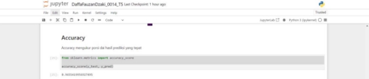

9. Pengenalan Precision dan Recall 

   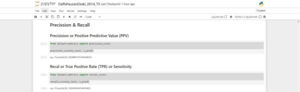

10. Pengenalan F1 Score | F1 Measure 

    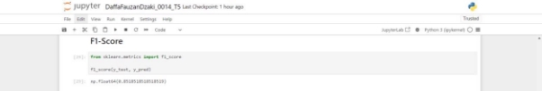

11. Pengenalan ROC | Receiver Operating Characteristic 

    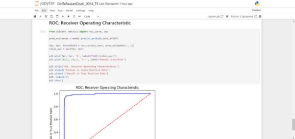
