TUGAS PERTEMUAN 5 MACHINE LEARNING 

Nama : Daffa Fauzan Dzaki 

Kelas : A1 

Npm  : 41155050210014 

0. K-Nearest Neighbours (KNN). Lakukan praktik dari https://youtu.be/4zARMcgc7hA?si=x6RoHQXFF4NY76X8 , buat screenshot dengan nama kalian pada coding, kumpulkan dalam bentuk pdf, dari kegiatan ini: 
0. Persiapan sample dataset 

   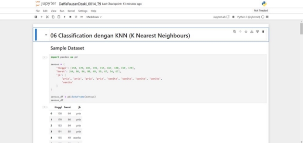

2. Visualisasi dataset 

   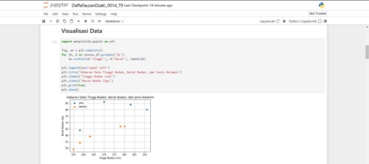

3. Pengantar classification dengan K-Nearest Neighbours | KNN 

   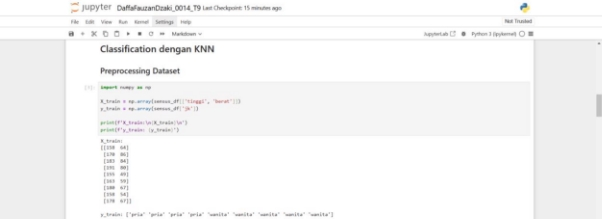

4. Preprocessing dataset dengan Label Binarizer 

   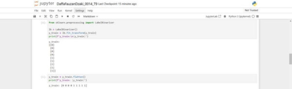

5. Training KNN Classification Model 

   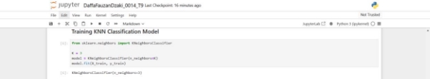

6. Prediksi dengan KNN Classification Model 

   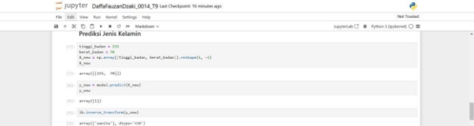

7. Visualisasi Nearest Neighbours 

   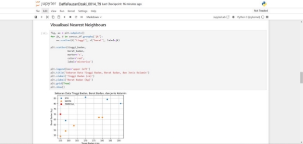

8. Kalkulasi jarak dengan Euclidean Distance 

   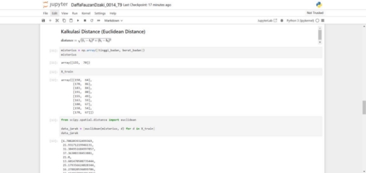

9. Evaluasi KNN Classification Model | Persiapan testing set 

   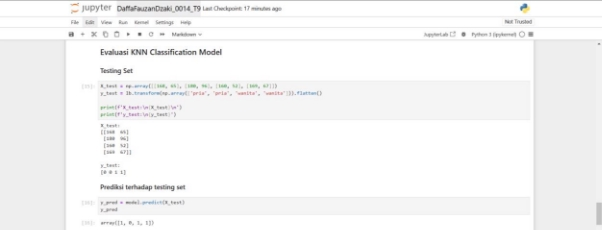

10. Evaluasi model dengan accuracy score 

    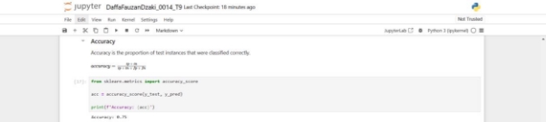

11. Evaluasi model dengan precision score 

    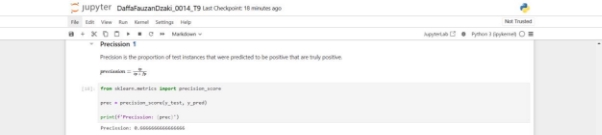

12. Evaluasi model dengan recall score 

    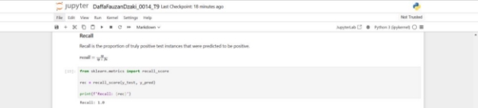

13. Evaluasi model dengan F1 score 

    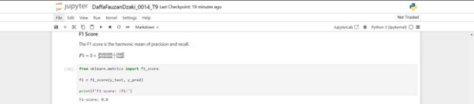

14. Evaluasi model dengan classification report 

    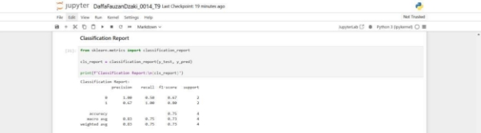

15. Evaluasi model dengan Mathews Correlation Coefficient 

    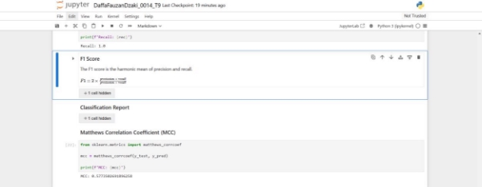

0. Support Vector Machine (SVM). Lakukan praktik dari https://youtu.be/z69XYXpvVrE?si=KR\_hDSlwjGIMcT0w , buat screenshot dengan nama kalian pada coding, kumpulkan dalam bentuk pdf, dari kegiatan ini: 
0. Pengenalan Decision Boundary & Hyperplane 

   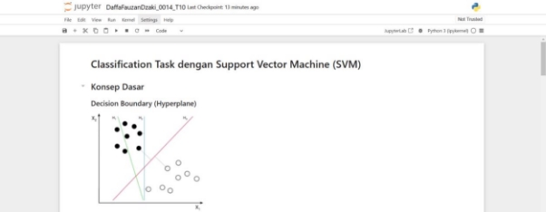

2. Pengenalan Support Vector & Maximum Margin 

   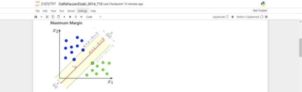

3. Pengenalan kondisi Linearly Inseparable dan Kernel Tricks 

   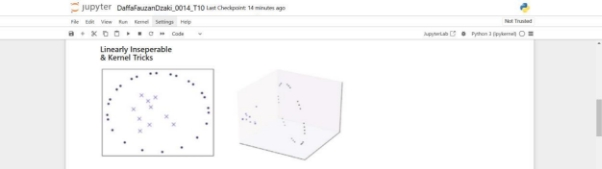

4. Pengenalan MNIST Handwritten Digits Dataset 

   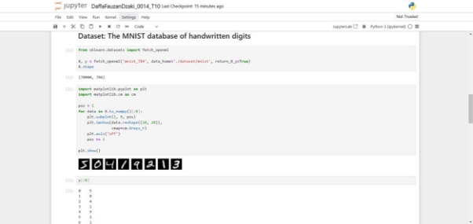

   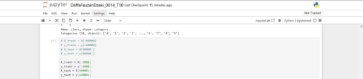

5. Klasifikasi dengan Support Vector Classifier | SVC 

   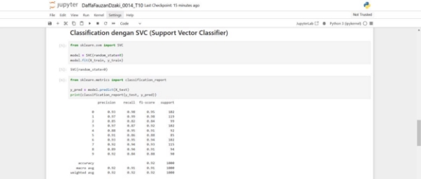

6. Hyperparameter Tuning dengan Grid Search 

   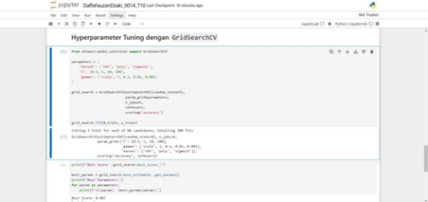

7. Evaluasi Model 

   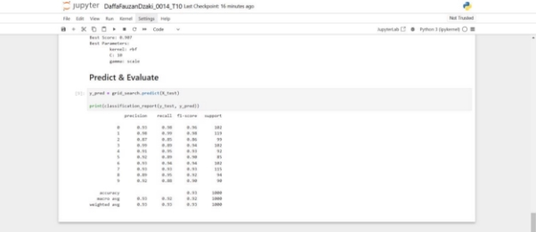
